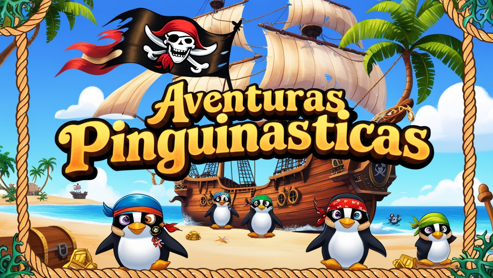

<div align="center">


<b>English</b> |
<a href="https://github.com/anotherlusitano/Aventuras-Pinguinasticas/blob/main/README.md">Português</a>

<h5>Welcome to Aventuras Pinguinásticas!</h5>
<h5>A strategy game that combines a console interface with a graphical interface, made in Java!</h5>

</div>

## About the Game

Aventuras Pinguinásticas is a game developed in Java as the final project for the Object-Oriented Programming course.

The game challenges the player to explore a 10x10 map, where the goal is to visit all the islands without running out of the boat’s resources.
Each island presents three possible choices, each with random gains and costs, forcing the player to adopt a smart strategy to complete the journey successfully.

The player navigates through the map using the console, and upon reaching an island, a menu is displayed via a graphical interface, allowing them to choose the best option to continue. The farther the player progresses, the more difficult the islands become, along with the amount of resources gained and spent.

## Development Team

| Nome           | Função                                                                                     |
| -------------- | ------------------------------------------------------------------------------------------ |
| João Ribeiro   | Class structuring and implementation of their functionalities                              |
| António Vieru  | Creation of graphical interfaces                                                           |
| Miguel Ribeiro | Player scoring system and display of some information in the mission’s graphical interface |

## Installation

Download the latest [.jar file](https://github.com/anotherlusitano/Aventuras-Pinguinasticas/releases/download/v1.0.0/AventurasPinguinasticas.jar).

Then open the console and run the `.jar` file with the following command:

```sh
java -jar AventurasPinguinasticas.jar
```
